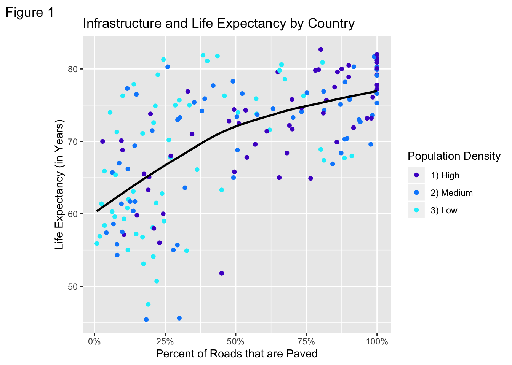
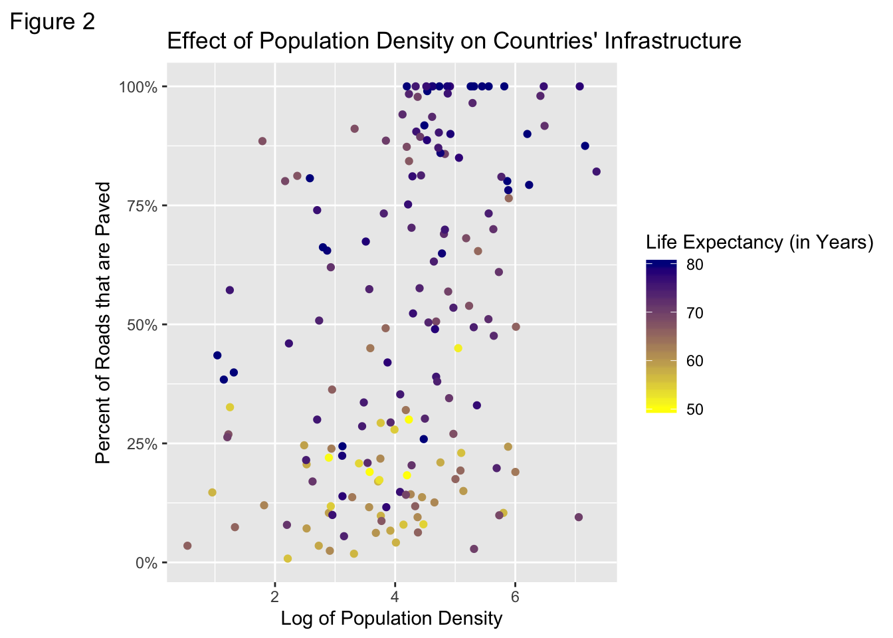

# Built Environment and Life Expectancy by Country

#### Conducted by Joel Breit and Farhaan Syed
#### Initially conducted December 2019. Updated January 2023

## Results Summary

Our research found that the proportion of roads paved in a country is correlated with life expectancy even when adjusting for population density. As the percentage of roads paved in a country rises, the life expectancy of that country does as well. Population density, which was identified as a potential confounding variable, was found not to have a significant impact on these variables.

## Methodology

We found this data on a website published by the the Gapminder Foundation with data on economy, health, education, etc. organized by country and by year (“Gapminder Data,” n.d.). We combined data tables for life expectancy by year and country, proportion of roads paved by year and country, and population density by year and country. To our knowledge, no previous study has been published on the relationship between the proportion of roads paved and life expectancy. We did find some articles addressing the relationship between infrastructure and life quality of life specifically we found an article asserting a positive relationship between population density and road density and between road quality and quality of life (Glover and Simon (1975)). In this paper, we assume that the proportion of roads paved is somewhat of a good measure of the quality of infrastructure in a country and use this to compare our results to the assertions of the article by Glover and Simon.

## Research

In figure 1 we charted life expectancy against proportion of roads paved and color-coded population density by category for later reference.

This data shows a fairly positive correlation between the proportion of roads paved and life expectancy. All countries with 50% or greater paved roads have a life expectancy of 65 or higher, whereas about half of countries with less than 50% paved roads have below that life expectancy. This could be the result of a confounding variable that is caused by and or causes both of these variables. We assumed this variable might be population density as the central point of the article we looked into was that higher population density affects road density. “If there are more people in a given geographic area, it will cost less per person to construct a common facility such as a road.” This would mean that population density makes roads more likely to be paved and makes living more cost efficient which could improve the life expectancy of a population. (Glover and Simon (1975))

To check whether the proportion of roads paved was correlated with life expectancy independent of population density, we graphed population density against proportion of roads paved and life expectancy.

As shown in figure 2, the correlation between population density and the proportion of roads paved is small and it is unclear if any correlation between population density and life expectancy even exists. Meanwhile, the correlation between the proportion of roads paved and life expectancy in a country remains clearly positive.

In order to further investigate the possibility of population density affecting our results, we measured life expectancy by 3 groups: 1) countries with population densities with higher than average population densities, 2) countries with about average population densities, and 3) countries with below average population densities. The countries were equally split between these three groups.

#### Figure 3: Life expectancy and proportion of roads paved, by Countries’ Population Densities

| **Portion Of Roads Paved**              | **Life Expectancy (Years)** |
|-----------------------------------------|----------------------------:|
| **All Countries**                       |                             |
| Less than 50% roads paved               |                        65.6 |
| More than 50% roads paved               |                        75.2 |
| **High Population Density Countries**   |                             |
| Less than 50% roads paved               |                        65.7 |
| More than 50% roads paved               |                        75.7 |
| **Medium Population Density Countries** |                             |
| Less than 50% roads paved               |                        65.4 |
| More than 50% roads paved               |                        74.9 |
| **Low Population Density Countries**    |                             |
| Less than 50% roads paved               |                        65.7 |
| More than 50% roads paved               |                        74.1 |

*Note:*
Data taken from years 2000-2009 in 174 countries

Figure 3 shows that life expectancy is considerably greater in countries with greater than 50% paved roads across all countries and across all three population density subgroups. However, the relationship between population density and life expectancy as life expectancy decreases from 65.7 down to 65.1 and back up to 65.7 years in the “less than 50% roads paved” as population density increases. This .4 year change is also not significant especially when compared to the nearly 10 year difference that paved roads group indicates.

We are not claiming that paved roads have a direct impact on life expectency, but that there is some correlation between the two. It is likely that another variable (e.g. GDP) or category of variables (industrialization) links these two factors, but investigating this was outside of the scope of this paper.

## References

“Gapminder Data.” n.d. Gapminder Foundation. https://www.gapminder.org/data/.

Glover, Donald R., and Julian L. Simon. 1975. “The Effect of Population Density on Infrastructure: The Case of Road Building.” *Economic Development & Cultural Change* 23 (453, 3). University of Chicago Press. https://doi.org/10.1086/450808.